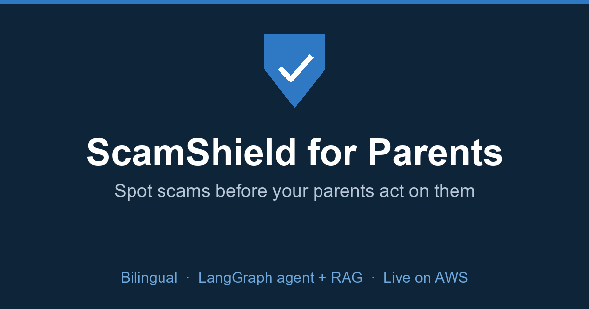

# 爸妈求证 (ScamShield for Parents)

[](https://16.61.100.161.sslip.io)

**A hybrid scam-safety AI agent: a deterministic risk floor + a Gemini
tool-calling agent orchestrated with LangGraph + bilingual pgvector RAG,
behind a JSON API with a Next.js/TypeScript frontend.**

**▶ Live:** [16.61.100.161.sslip.io](https://16.61.100.161.sslip.io) — the full
production stack on **AWS EC2** (Docker Compose + Caddy auto-HTTPS, real
Postgres/pgvector + Redis). Also on Render:
[parent-check.onrender.com](https://parent-check.onrender.com).

#### What it is

爸妈求证 (ScamShield for Parents) is a bilingual web app that helps elderly
people — in my case, Chinese-speaking seniors living in the UK — pause and get a
second opinion when they see something they aren't sure about: a health article,
a miracle-cure advert, a suspicious text, or a strange link. The user pastes the
text, picks where it came from, and the app returns a **conservative** verdict,
points out exactly which signals looked risky, says what *not* to do right now,
and — most importantly — drafts a short message they can forward to their adult
children to confirm.

Under the hood it is not a single model call and not a pile of `if` statements.
It is a **layered safety system** where a deterministic rule engine sets a risk
*floor* that AI can raise but never lower, and a Gemini **tool-calling agent**
does a second-opinion pass — deciding for itself whether to search a bilingual
**RAG** knowledge base of known scams or run a phone-number checker before
committing to a verdict. Every layer is built around one product principle: in a
domain where a wrong "safe" can cost someone their savings or their health, the
system is only ever allowed to escalate caution, never to grant reassurance.

#### Why this shape

The interesting engineering problem here isn't "how good is the model". A large
model is perfectly capable of judging a scam message. The hard part is building
an AI product that is *trustworthy for a high-stakes, vulnerable user* — one
where the failure that matters (a scam waved through as "safe") is asymmetrically
worse than the annoying failure (a benign message flagged). That asymmetry drove
every architectural choice below, and it is the part I care about as an AI
engineer.

The need is also real and local. Fraud is one of the largest crime categories in
England and Wales — the ONS estimated around 4.2 million fraud incidents in the
year ending March 2025, ~3 million of them involving a loss, and the Home Office
put the cost of fraud at ~£14.4 billion for the year ending March 2024. My
specific users — Chinese-speaking elderly in the UK — sit in a gap: UK tools are
in English and aimed at British channels, while tools from China can't reach
them. They receive *both* Chinese health rumours and English UK scam texts.

## Architecture: a layered safety system

A single message flows through the pipeline top to bottom. Each layer can only
**raise** the risk level; none can lower it.

```
user text ──► [1] normalise ──► [2] deterministic rule engine ──► base risk
                                       (keywords · blocklist · semantic)
                                                                        │
                                            base risk (the safety floor)│
                                                                        ▼
              final risk ◄── [3] Gemini tool-calling agent (escalate-only)
                                    │        │
                                    ▼        ▼
                        query_knowledge_base   check_phone_numbers
                             (bilingual RAG)      (number classifier)
```

**[1] Normalisation** (`normalize.py`) folds text to a compact form (full-width→
half-width, lower-case, strip spacing/punctuation) so evasions like `验 证 码`
still match.

**[2] The deterministic floor** (`helpers.py`, `keywords.py`, `blocklist.py`,
`semantic.py`) scores the text with transparent, explainable rules: a bilingual
keyword library, a threat-intel check on links/phone numbers, and a *semantic
escalation* heuristic that catches keyword-free scams (family impersonation =
new-number + money + urgency) by the co-occurrence of structural signals. This
layer is the **safety floor** — it runs with no API key, no network, and its
output is a lower bound on the final risk.

**[3] The Gemini agent** (`ai/agent_graph.py`) takes a second look *only* to find
what the rules missed. It is a genuine tool-calling agent, not a one-shot prompt:
given the message, it decides whether it needs more evidence, calls tools, reads
the results, and then commits to a verdict — bounded to raising the risk. The
loop is a **LangGraph state machine** (see below).

Verdicts are worded to avoid false reassurance. There are three, and none of
them is the word "safe":

- **暂未发现明显风险，仍建议确认** — no obvious risk found, still check
- **要小心** — be careful
- **很可能有问题** — very likely a problem

## The agent — a LangGraph state machine (`ai/agent_graph.py`)

The agent loop is a **LangGraph** `StateGraph` with two nodes and a conditional
router, rather than a hand-rolled loop:

```
        ┌───────────────────────────────────────┐
        ▼                                         │ (tool results)
   ┌────────┐   wants a tool?   ┌────────┐        │
   │ reason │ ───────────────►  │ tools  │ ───────┘
   └────────┘                   └────────┘
        │  final verdict
        ▼
       END
```

1. The user message is wrapped in `<message>` tags and explicitly labelled as
   **data, not instructions**, with a directive to ignore anything inside it that
   tries to change the verdict — because scam messages are themselves adversarial
   input (see *Prompt-injection defence*).
2. The **`reason`** node asks Gemini (given the two tool declarations) whether to
   call `query_knowledge_base`, `check_phone_numbers`, both, or neither. The
   conditional edge routes to the `tools` node if it asked for tools, or to `END`
   if it produced a verdict.
3. The **`tools`** node runs the requested calls **in parallel**
   (`run_tools_parallel`, a `ThreadPoolExecutor` with a hard timeout) and feeds
   the results back as one turn, then loops to `reason`.
4. The **turn budget is enforced by the graph's edges** — the router refuses to
   re-enter `reason` once the budget is spent, instead of relying on an
   off-by-one `for` loop. The reply is parsed into `{risk, reason, advice}` and
   `pick_higher_risk()` merges it with the rule-based floor, so the agent can only
   ever escalate.

Per-request dependencies (the Gemini client, the language's RAG engine) are
injected through the run **config**, not the serialized state; a checkpointer
records each step (in-memory here, swappable for LangGraph's `PostgresSaver`
since this project already runs Postgres) and the run's thread is dropped when it
finishes. Why bother over the ad-hoc loop: named nodes and an explicit router
make the control flow inspectable, and the turn cap and fallback behaviour live
in the graph structure instead of imperative bookkeeping.

> The original hand-rolled two-turn loop is kept in **`ai/agent.py`** as a
> readable contrast; both share the same prompt builder, parser and escalate-only
> merge, so the safety behaviour can't drift between them.

The two tools:

- **`query_knowledge_base`** — semantic retrieval over the RAG store of past
  scam cases, returning the closest matches with their type and analysis.
- **`check_phone_numbers`** — extracts phone numbers from the message and
  classifies each (UK premium-rate / international / mobile / official helpline,
  or the Chinese equivalents), giving the model structured evidence it can't
  reliably eyeball from raw text.

## Bilingual RAG (`ai/rag_engine.py`)

A retrieval layer over a curated bilingual corpus of known scams:

- Each scam case (`data/scams_{zh,en}.json`) is embedded with Gemini
  `text-embedding-004` and stored in a native **pgvector** column
  (`scam_cases.embedding`, `vector(768)`).
- Retrieval is an indexed nearest-neighbour search in Postgres —
  `ORDER BY embedding <=> query` over an **HNSW cosine index** — so it stays fast
  as the corpus grows, behind the same `retrieve_similar()` interface
  (`ai/rag_engine.py`).
- The store is **seeded once on first run** and separated by language, so the
  Chinese and English knowledge bases never cross-contaminate retrieval.

> Earlier versions stored embeddings as a JSON array in SQLite and ranked them
> with a Python cosine loop — honest and fine for a few dozen rows. The migration
> to pgvector (see [*Running in production*](#running-in-production)) removes that
> scaling ceiling without changing the retrieval interface.

## AI safety design (the point of the project)

Every decision here follows from "never give a vulnerable user a false sense of
safety":

- **Escalate-only contract.** The deterministic floor is a lower bound. The
  semantic heuristic, the optional learned model, and the LLM agent can each only
  *raise* risk. This is enforced in code (`pick_higher_risk`, `semantic.escalate`),
  not just documented, so no probabilistic component can ever downgrade a warning.
- **Fail-safe, and fail-*loud enough*.** If the API key is missing, the network
  fails, or the model returns a malformed reply, the AI step is skipped and the
  rule-based verdict stands — the app degrades gracefully to the floor. Failures
  are logged with their error type for observability rather than swallowed
  silently, so a broken agent is visible instead of quietly disabled.
- **Never "safe".** The system prompt forbids the model from ever outputting a
  safe verdict; the parser defaults an unrecognised reply to *caution* rather than
  dropping the warning. Even the lowest verdict is worded "no obvious risk found,
  still check", shown in a neutral colour, not green.
- **Prompt-injection defence.** User text is passed as tagged data with explicit
  instructions to ignore embedded directives — treating the scam message as the
  adversarial input it is, not as a trusted continuation of the prompt.
- **Privacy floor for a sensitive domain.** The AI step is *optional* and
  key-gated; with no key the app runs fully locally. The original pasted text is
  **never persisted** — only the verdict, category, matched signals and timestamp
  — so the history feature can't become a breach surface.

## Running in production

This isn't just a prototype — it runs live. The same `docker compose` stack that
comes up locally (`docker compose up --build`) is what serves the public site,
deployed on a single **AWS EC2** instance behind Caddy, with real Postgres/
pgvector and Redis running as containers:

```
Internet ─► Caddy (auto-HTTPS) ─► gunicorn (Flask) ─┬─► PostgreSQL 16 + pgvector
   :443                              :8000           └─► Redis 7
              observability: OpenTelemetry traces · JSON logs · Prometheus /metrics
```

The stack is defined once in `docker-compose.prod.yml` and is reproducible on any
host. For a managed-services deployment, `infra/` additionally provides a
**Terraform** stack (ECS Fargate + RDS + ElastiCache + ALB + ECR + Secrets
Manager + a GitHub-OIDC deploy role) as infrastructure-as-code — the same
architecture, provisioned on demand.

- **PostgreSQL + pgvector.** History and scam-case embeddings live in Postgres;
  retrieval is a native, HNSW-indexed `embedding <=> query` search. A SQLAlchemy
  data layer (`db.py`, `repo.py`) keeps SQL out of the routes, and **Alembic**
  owns schema migrations (`migrations/`, `RUN_POSTGRES.md`).
- **Redis.** A sliding-window rate limiter (`ratelimit.py`) enforced across all
  workers/tasks via a Lua-atomic Redis script, degrading to an in-process window
  when Redis is unavailable — so a single worker's limit can't be multiplied by
  fan-out, and the app never 500s just because Redis is down.
- **Observability** (`observability.py`): OpenTelemetry auto-instruments Flask,
  outbound `requests`, and SQLAlchemy into one trace per request; logs are JSON
  carrying `request_id`/`trace_id`; `/metrics` exposes a Prometheus latency
  histogram (P50/P95). Each pillar degrades independently if its library is absent.
- **MCP server** (`mcp_server.py`, `MCP.md`): the agent's own tools —
  `check_phone_numbers` and `query_knowledge_base` — are also exposed over the
  **Model Context Protocol**, with published schemas, input validation, and audit
  logging, so any MCP client (Claude Desktop, an IDE, another agent) can call them.
- **Infrastructure as code** (`infra/`): **Terraform** provisions RDS,
  ElastiCache, ECS Fargate, ECR, Secrets Manager, an ALB, and a GitHub-OIDC
  deploy role (no long-lived AWS keys).
- **CI/CD with an eval gate**: GitHub Actions runs the tests and an offline
  **quality gate** (`evaluate.py`) — a classifier regression in accuracy, scam
  recall, missed scams, or false alarms fails the build and **blocks the deploy** —
  then builds the image, pushes to ECR (OIDC), and rolls the ECS service.

## Web frontend (`frontend/` — Next.js + TypeScript + Tailwind)

The same analysis pipeline is exposed as a **JSON API** (`POST /api/check`) and
consumed by a **Next.js** (App Router) + **TypeScript** + **Tailwind CSS**
single-page frontend, decoupling the UI from the backend:

```
Next.js (TS) ──fetch──► POST /api/check (Flask, CORS-scoped) ──► same pipeline:
   :3000                    :8000                                 rules → LangGraph AI
```

- `/api/check` is **stateless**: language and source come from the request body,
  it stores no history and carries no session — so it's exempt from the form-CSRF
  check and guarded instead by a CORS allow-list (`FRONTEND_ORIGIN`) and the same
  per-IP rate limit. It reuses the identical rule-engine → LangGraph → view
  pipeline as the server-rendered `/check`, so the two UIs can't diverge.
- The frontend (`frontend/app/page.tsx`, `components/ResultCard.tsx`) is a typed
  client: `lib/types.ts` mirrors the API contract, `lib/api.ts` is the `fetch`
  wrapper, and the risk badge is colour-coded green/amber/red with a bilingual
  (zh/en) one-tap toggle. See [`frontend/README.md`](frontend/README.md).

## Files

- **app.py** — the Flask app: routes (server-rendered `/check` **and** the JSON
  `/api/check`), a SQLAlchemy/Postgres data layer, and the orchestration that runs
  the rule engine, then (if a key is set) the LangGraph agent, then applies the
  escalate-only merge before saving and rendering.
- **ai/agent_graph.py** — the **LangGraph** state machine the app runs: the
  `reason`/`tools` nodes, the conditional router and turn budget, config-injected
  dependencies, and a checkpointer.
- **ai/agent.py** — the original hand-rolled two-turn loop, kept as a contrast,
  plus the shared prompt builder, reply parser and escalate-only risk merge.
- **frontend/** — the Next.js + TypeScript + Tailwind frontend that calls
  `/api/check`.
- **ai/tools.py** — the tool declarations plus `query_knowledge_base` and
  `check_phone_numbers`, run in parallel with a timeout.
- **ai/rag_engine.py** — the bilingual RAG store: embed, seed, and HNSW-indexed
  cosine retrieval over a native **pgvector** column in Postgres.
- **ai/llm_client.py** — a thin `requests` wrapper over Gemini
  (`generateContent` + embeddings), where every failure returns `None` so the
  app can carry on.
- **helpers.py** — the deterministic scoring engine: turns text into
  language-neutral risk/category/evidence codes.
- **keywords.py** — the bilingual keyword library (CRITICAL / SCAM / HEALTH /
  BENIGN), covering both Chinese rumour vocabulary and English UK-scam vocabulary.
- **blocklist.py** — deterministic threat-intel on links and numbers (raw-IP
  links, shorteners, scam-prone TLDs, punycode, UK premium-rate numbers).
- **semantic.py** — the keyword-free escalation heuristic, plus the optional
  learned-model slot (escalate-only, off by default).
- **fetch_url.py** — fetches and extracts article text from a pasted link, with
  SSRF protection that re-validates the host **after redirects**.
- **normalize.py** — text folding so spaced-out / full-width evasions still match.
- **translations.py** — every user-facing string in Chinese and English, keyed
  by code, so even saved history re-renders in either language.
- **regions.py** — UK vs China build config (hotline, reporting channel, privacy
  regime) via the `REGION` env var.
- **schema.sql** — the `checks` table (verdicts, never raw text) and the
  `scam_cases` RAG table (text + embedding).
- **evaluate.py**, **tests/** — a labelled evaluation set and the accuracy
  harness; unit tests for the judgement logic, CSRF, and per-browser isolation.
- **templates/**, **static/** — large-font, three-colour (green/amber/red) UI
  designed for older eyes.

## Bilingual by design

My target users fall into a gap: UK tools (Action Fraud, Age UK) are English and
aimed at British channels; tools from China can't reach them. So the app runs
fully in Chinese or English (one-tap toggle), the keyword library and the RAG
store both cover both languages, and because every verdict is stored as a *code*
rather than a sentence, even old history records re-render in whichever language
the user picks.

## The deterministic floor, measured

The floor isn't a throwaway baseline — it does real work and I measure it. On a
hand-labelled 61-case set (`python evaluate.py`) it scores **97% exact accuracy**
and, the metric that matters most, **100% scam recall with zero missed scams**
across UK smishing, fake-authority, investment/job, and impersonation types, in
both languages. Missed scams and false alarms are reported *separately* because
they are not equally bad — a missed scam is dangerous, a false alarm is merely
annoying — so the engine is tuned to lean toward warning. Measuring it directly
drove the design: an early miss on a keyword-free impersonation ("Mum, I changed
my number, send me some money") is exactly what motivated the semantic layer, and
now the RAG store and LLM agent, all behind the same escalate-only contract.

I also trained a small character-n-gram TF-IDF + logistic-regression classifier
(`train_model.py`, `model/`) for the same escalate-only slot. Measured honestly
it doesn't yet earn its place (~0.61 CV F1 on a 64-example corpus; the scam/benign
probabilities overlap), so it's **off by default** — the honest lesson being that
here the bottleneck is *data, not architecture*. It's kept behind the
deterministic floor so it can be switched on safely once there's enough data. The
web app needs no ML dependencies to run.

## Security and privacy

Because users paste real messages that may contain personal data, I treated this
as a security tool, not just a web form:

- **Data minimisation** — the pasted text is **never stored**. Only the verdict,
  category, matched signals and timestamp are saved, keyed to an anonymous
  per-browser id, so each visitor sees only their own history.
- **AI is opt-in and privacy-scoped** — the agent is off unless `GEMINI_API_KEY`
  is set; with no key the whole app runs locally. Only the message text (capped)
  is sent to Gemini for the second-opinion pass, never the user's history or id.
- **Prompt-injection hardening** — user text is passed to the model as tagged
  data with explicit instructions to ignore embedded directives.
- **No SQL injection / no XSS** — every query is parameterised; all user content
  is rendered through Jinja autoescaping (no `| safe`).
- **SSRF protection** — pasted links are validated against internal/loopback/
  metadata addresses, and the final URL is re-checked **after redirects** so an
  external page can't bounce the fetcher onto an internal address.
- **CSRF** — every POST form carries a per-session token; `SameSite=Lax` cookies
  are a second layer. Session cookies are `HttpOnly` and `Secure` in production.
- **Right to erase** — `POST /history/clear` deletes a browser's records.
- **Config hardening** — `debug` off in production; the secret key is *required*
  from the environment (no fallback); dependencies pinned; `source` whitelisted;
  submitted text length-capped; POSTs rate-limited per client IP.
- **Logging** — verdicts and errors are logged for observability, but **never**
  the text the user submitted.
- **Tested** — `python -m pytest` covers the judgement logic, CSRF rejection and
  per-browser isolation; CI runs ruff + pytest + the accuracy check on every push.

Known limits for a larger deployment: a data-retention policy on the Postgres
history table, and automated dependency scanning (`pip-audit` / Dependabot). The
Postgres migration, pgvector retrieval and shared Redis rate-limit store that
earlier versions listed here as future work are now in place (see *Running in
production*).

## How to run

The whole stack (app + PostgreSQL/pgvector + Redis) runs with one command:

```bash
docker compose up --build
```

Then open `http://localhost:8000` for the server-rendered app. The page is
mobile-friendly, and `http://localhost:8000/metrics` exposes the Prometheus
metrics. See [`RUN_POSTGRES.md`](RUN_POSTGRES.md) for running against Postgres
without Docker and for the Alembic migration workflow.

**For the Next.js frontend**, with the backend running, start the dev server
separately (`cd frontend && npm install && npm run dev`) and open
`http://localhost:3000`; it calls the backend's `/api/check`. See
[`frontend/README.md`](frontend/README.md).

**To enable the AI layer**, set a free Gemini API key
(https://aistudio.google.com/app/apikey) — copy `.env.example` to `.env` and fill
in `GEMINI_API_KEY`, or set it in the environment. Without a key the app runs on
the deterministic floor and the AI/RAG step simply stays off; `SEMANTIC_MODEL=1`
(plus `requirements-ml.txt`) enables the optional local classifier.

## Limitations and future work

This is a prototype, and it's deliberately conservative about scope: it doesn't
read messages automatically, handle payments, or give medical advice. Natural
next steps, all behind the same escalate-only, privacy-preserving contract: OCR
for uploaded screenshots, growing the RAG corpus from confirmed cases (the
`add_case` path already exists), a feedback loop that learns from the "was this
helpful?" signal, and real notifications to family members. The bigger product
bet is to shift the primary user toward the *adult child* — the person who
actually helps a parent verify a suspicious message — because turning a lonely
yes/no into a family conversation is the real value, more than any single model.
